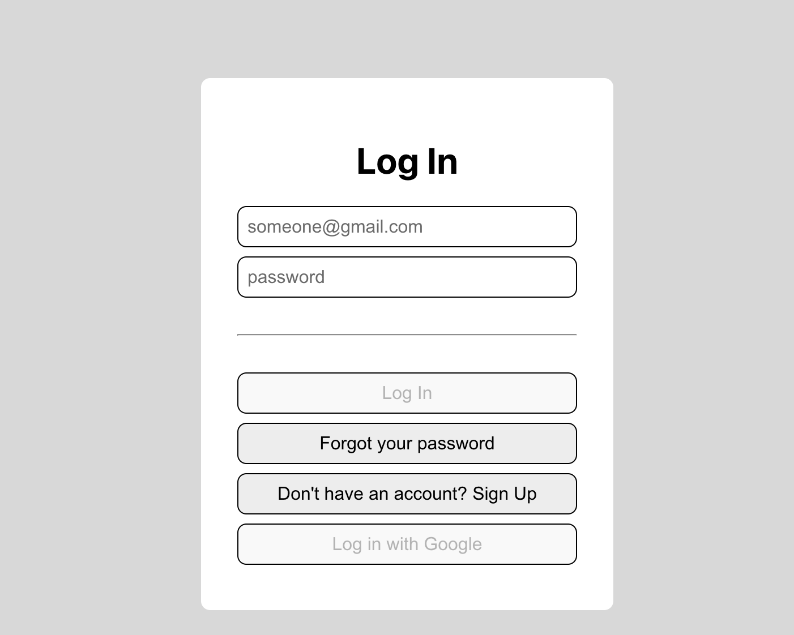

<!-- PROJECT TITLE -->
<br />
<div align="center">

<h2 align="center">React authentication with Mongodb + AWS</h3>
<p align="center"> Linkedin course by Shaun Wassell</p>
<br />
</div>
<br/>

## About the project

I've followed this LinkedIn <a href="https://www.linkedin.com/learning/react-authentication">course</a> offered by Shaun Wassell. It dives into the details behind user authentication in the context of React and how to incorporate user authentication into React applications. It explains how to give users the ability to reset their passwords, then describes the steps in setting up OAuth. He goes over several prebuilt authentication options, then concludes with some best practice recommendations.

I am on my way to achieve a fullstack overview, here's why -> :rocket: [go fullstack!](https://martaboteller.com/fullstack)

<br/>



<br/>

## Built with

Major frameworks/libraries used:

- Node.js/Express/Mongodb (server)
- React (frontend)
- Babel
- Axios
- Bcrypt
- Dotenv
- Googleapis
- Jsonwebtoken
- Uuid
- Sendgrid/mail
- Aamazon-cognito-identity-js
- Aws-sdk

<br/>

## Aws cognito

Updated version of <a href="https://github.com/martaboteller/react-auth-mongodb">React Authentication MongoDB project </a>. Modified files include:

```
logInRoute.js
signUpRoute.js
forgotPasswordRoute.js
resetPasswordRoute.js
verifyEmailRoute.js
+ awsUserPool.js
```

<br/> <br/>

## Author

I'm Marta Boteller, little more about me at my [website](https://martaboteller.com).

<br/> <br/>

## Acknowledgments

<p>I would like to thank <a href="https://www.linkedin.com/learning/react-authentication">Shaun Wassell </a> for his fantastic way of theaching!
